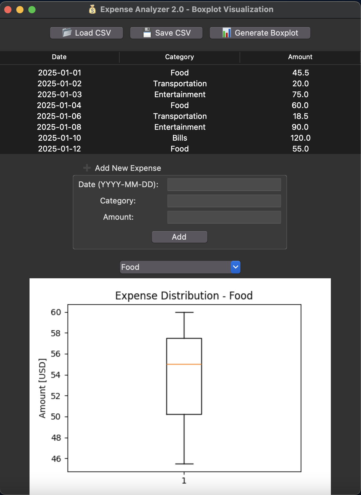

# Expense Analyzer 2.0


## 📊 Overview

Expense Analyzer 2.0 is a user-friendly desktop application for tracking and visualizing personal expenses using statistical boxplots. The tool helps you understand your spending patterns through powerful data visualization.



## ✨ Features

- **CSV Integration**: Import/export your expense data
- **Data Management**: Add, view, and organize expenses
- **Interactive Table**: Scroll through your expense history
- **Boxplot Visualization**: See statistical distribution of spending by category
- **Simple Interface**: Intuitive controls with modern widgets

## 🛠️ Installation

1. Ensure you have Python 3.6+ installed
2. Install required packages:
   ```bash
   pip install pandas matplotlib
